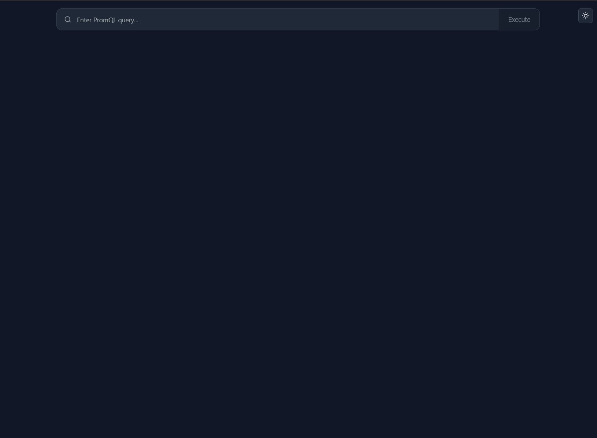

# PolyStat Dashboard

<div align="center">
  
</div>

A comprehensive web application inspired by the Coralogix Polystat widget for visualizing Prometheus metrics in a hexagonal grid layout with color-coded thresholds. The application supports high-cardinality metrics and provides a modern user experience.

## 🏗️ Architecture

### Technology Stack

**Frontend**
- **Framework**: React 18.2.0 with TypeScript 5.2+
- **Build Tool**: Vite 6.3+ for fast development and optimized builds
- **State Management**: TanStack React Query 4.36+ for server state
- **UI**: Custom hexagonal visualization using D3.js concepts
- **Styling**: CSS-in-JS with dynamic theming support

**Backend**
- **Framework**: FastAPI 0.116+ with Python 3.11+
- **Validation**: Pydantic 2.11+ for robust data validation
- **HTTP Client**: httpx 0.28+ for Prometheus API communication
- **Configuration**: Environment-based settings with python-dotenv

**Development & Testing**
- **Frontend Testing**: Vitest 3.2+ with Testing Library
- **Backend Testing**: pytest (ready for implementation)
- **Linting**: ESLint + TypeScript ESLint (frontend), comprehensive Python tooling (backend)
- **Type Safety**: Strict TypeScript and Python type checking

## 📋 Features

### Core Visualization
- **Hexagonal Grid**: Canvas-based rendering with optimized layout algorithms
- **Dynamic Thresholds**: Configurable color-coded value ranges
- **High Performance**: Handles 1000+ hexagons with smooth interactions
- **Responsive Design**: Adaptive layout for different screen sizes

### Advanced Grouping
- **Multi-level Grouping**: Hierarchical data organization by Prometheus labels
- **Interactive Filtering**: Click-to-drill-down with breadcrumb navigation
- **Dynamic Clustering**: Automatic group layout with zoom optimization
- **Filter Stack**: Visual representation of applied filters

### Prometheus Integration
- **PromQL Support**: Full Prometheus Query Language support with validation
- **Real-time Queries**: Instant query execution with error handling
- **Label Discovery**: Automatic detection of available metric labels
- **High Cardinality**: Optimized for metrics with many label combinations

### User Experience
- **Dark/Light Theme**: System-aware theme switching
- **Loading States**: Comprehensive loading and error handling
- **Navigation**: Accessible interface design

## 🚀 Quick Start

### Prerequisites
- **Node.js** 18.0+ (for frontend development)
- **Python** 3.11+ (for backend development)
- **Prometheus** instance (accessible for queries)

### Development Setup

#### Automated Setup (Recommended)
```bash
# Clone the repository
git clone <repository-url>
cd polystat

# Start development environment (sets up both frontend and backend)
./start-dev.sh
```

#### Manual Setup

**Backend Setup:**
```bash
cd polystat-backend

# Create and activate virtual environment
python3 -m venv venv
source venv/bin/activate

# Install dependencies
pip install -r requirements.txt

# Configure environment (copy and edit)
cp env.example .env

# Start development server
uvicorn app.main:app --reload --host 0.0.0.0 --port 8000
```

**Frontend Setup:**
```bash
cd polystat-frontend

# Install dependencies
npm install

# Start development server
npm run dev
```

### Access Points
- **Application**: http://localhost:3000
- **API Documentation**: http://localhost:8000/docs
- **Backend API**: http://localhost:8000
- **Health Check**: http://localhost:8000/health

## 📁 Project Structure

```
polystat/
├── polystat-frontend/              # React TypeScript application
│   ├── src/
│   │   ├── components/
│   │   │   ├── PolyStat/          # Core visualization components
│   │   │   │   ├── HexGrid.tsx    # Main hexagonal grid renderer
│   │   │   │   ├── Hexagon.tsx    # Individual hexagon component
│   │   │   │   ├── LabelSelector.tsx # Label selection interface
│   │   │   │   ├── FilterStack.tsx    # Filter breadcrumbs
│   │   │   │   ├── FloatingGroupHeaders.tsx # Group headers
│   │   │   │   ├── LoadingSpinner.tsx # Loading states
│   │   │   │   └── ErrorDisplay.tsx   # Error handling
│   │   │   ├── PromQLInput.tsx    # Prometheus query input
│   │   │   └── ThemeToggle.tsx    # Theme switching
│   │   ├── hooks/
│   │   │   ├── usePolyStat.ts     # Core polystat logic
│   │   │   └── usePrometheus.ts   # Prometheus API integration
│   │   ├── contexts/
│   │   │   └── ThemeContext.tsx   # Theme management
│   │   ├── types/
│   │   │   └── polystat.ts        # TypeScript definitions
│   │   ├── utils/
│   │   │   ├── formatters.ts      # Value formatting utilities
│   │   │   └── textMeasure.ts     # Text measurement helpers
│   │   └── constants/
│   │       └── ui.ts              # UI constants and configuration
│   ├── package.json               # Frontend dependencies
│   ├── vite.config.ts            # Vite configuration
│   ├── tsconfig.json             # TypeScript configuration
│   └── vitest.config.ts          # Test configuration
├── polystat-backend/              # FastAPI Python backend
│   ├── app/
│   │   ├── main.py               # FastAPI application entry point
│   │   ├── api/v1/
│   │   │   └── prometheus.py     # Prometheus API endpoints
│   │   ├── core/
│   │   │   ├── config.py         # Application configuration
│   │   │   └── constants.py      # Backend constants
│   │   ├── schemas/
│   │   │   └── prometheus.py     # Pydantic data models
│   │   └── services/
│   │       └── prometheus_client.py # Prometheus client service
│   ├── requirements.txt          # Python dependencies
│   ├── Dockerfile               # Backend container definition
│   └── env.example              # Environment configuration template
├── Dockerfile                   # Multi-stage production build
├── start-dev.sh                # Development startup script
├── image-builder.sh            # Production image builder
├── CLAUDE.md                   # Development instructions
└── README.md                   # This file
```

## 🔧 Development

### Available Scripts

**Frontend (`polystat-frontend/`)**
```bash
npm run dev              # Start development server
npm run build            # Production build
npm run type-check       # TypeScript type checking
npm run lint             # ESLint code analysis
```

**Backend (`polystat-backend/`)**
```bash
# Virtual environment activation required
source venv/bin/activate

uvicorn app.main:app --reload    # Development server
python -m pytest               # Run tests (when implemented)
```

### Configuration

**Backend Environment Variables (`polystat-backend/.env`)**
```bash
# Prometheus connection
PROMETHEUS_URL=http://localhost:9090
PROMETHEUS_TIMEOUT=30

# CORS configuration
CORS_ORIGINS=http://localhost:3000,http://localhost:5173

# Static files (for production)
STATIC_FILES_DIR=./static
```

**Frontend Configuration**
- API proxy configured in `vite.config.ts` for development
- Environment-specific builds via Vite configuration
- TypeScript strict mode enabled for type safety

## 🐳 Deployment

### Docker Deployment

```bash
# Build image
docker build -t polystat-dashboard .

# Run container
docker run -p 8000:8000 \
  -e PROMETHEUS_URL=http://your-prometheus:9090 \
  polystat-dashboard
```

### Considerations

**Performance Optimization**
- Frontend build includes code splitting and tree shaking
- Backend uses async operations with connection pooling
- Optimized hexagon rendering for 1000+ metrics
- Efficient memory management for high-cardinality data

**Security Features**
- CORS configuration for cross-origin requests
- Path traversal protection in static file serving
- Input validation via Pydantic schemas
- Non-root user in Docker containers

**Monitoring & Health**
- Health check endpoint at `/health`
- Structured logging throughout the application
- Error boundary components in React
- Comprehensive error handling in FastAPI

## 📊 Usage Examples

### Basic Prometheus Queries
```promql
# CPU usage by container
rate(container_cpu_usage_seconds_total[5m])

# Memory usage
container_memory_usage_bytes

# Network I/O
rate(container_network_receive_bytes_total[5m])
```

### Grouping Examples
1. Execute a PromQL query
2. Click on a label (e.g., "cluster") to group metrics
3. Click on a group header to drill down
4. Use filter breadcrumbs to navigate back

### Advanced Features
- **Multi-level Grouping**: Group by namespace → service → pod
- **Dynamic Zoom**: Automatic zoom adjustment based on group density
- **Color Thresholds**: Value-based coloring

## 🤝 Contributing

### Development Workflow
1. **Setup**: Use `./start-dev.sh` for automated environment setup
2. **Code Style**: Follow ESLint (frontend) and Python standards (backend)
3. **Type Safety**: Maintain strict TypeScript and Python typing
4. **Testing**: Add tests for new features (frameworks in place)
5. **Documentation**: Update this README for significant changes

### Code Quality Standards
- **Frontend**: TypeScript strict mode, ESLint with React hooks rules
- **Backend**: Type hints, Pydantic validation, comprehensive error handling
- **Both**: Clean architecture patterns, separation of concerns

## 📈 Performance Benchmarks

- **Rendering**: Smooth with 1000+ hexagons
- **Memory Usage**: < 100MB for typical workloads
- **Bundle Size**: < 2MB gzipped frontend assets

## 🔒 Security

- **Input Validation**: Comprehensive validation on all API endpoints
- **CORS**: Configurable cross-origin resource sharing
- **Path Security**: Protection against directory traversal attacks
- **Container Security**: Non-root user execution in Docker
